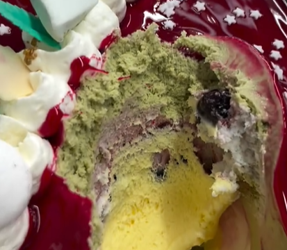

<h2>Specialità di Pasqua</h2>

  A Pasqua, da ZanziBar Olivarella la dolcezza non è solo una promessa: è un'esperienza. Le nostre uova artigianali sono scrigni di gusto, realizzate con passione e farcite con creme ricche e avvolgenti.

<ul>
  <li><strong>Pistacchio</strong>: una crema vellutata e intensa, per veri amanti del verde oro di Sicilia.</li>
  <li><strong>Kinder Bueno</strong>: croccante, cremoso, irresistibile. Il gusto più desiderato da grandi e piccoli.</li>
  <li><strong>Caramello salato</strong>: il perfetto equilibrio tra dolce e deciso, per un finale sorprendente.</li>
  <li><strong>Caramello classico</strong>: dolce, avvolgente, che sa di coccola.</li>
</ul>

  Ogni uovo è unico, rifinito a mano e pronto a stupirti con gusti nuovi e combinazioni inedite. È più di un dolce: è un regalo che profuma di festa, eleganza e bontà.

  Da ZanziBar, la Pasqua è un trionfo di dolcezza con le nostre colombe artigianali, preparate con ingredienti di altissima qualità e una creatività senza pari. Scopri i nostri gusti esclusivi:

<ul>
  <li><strong>Colomba al pistacchio</strong>: Un'armonia di soffice panettone e il cremoso sapore del pistacchio, per una Pasqua tutta siciliana.</li>
  <li><strong>Colomba Kinder Bueno (bianca e scura)</strong>: La dolcezza avvolgente del cioccolato Kinder Bueno, disponibile nelle versioni bianca e scura, per un'esplosione di golosità.</li>
  <li><strong>Colomba fondente</strong>: Un incontro perfetto tra il panettone soffice e il cioccolato fondente più intenso, per chi ama i sapori decisi.</li>
  <li><strong>Colomba alla Nutella</strong>: La celebre crema alla nocciola, spalmata su una soffice colomba, è il sogno di ogni goloso.</li>
  <li><strong>Mezzi gusti</strong>: Per chi non sa scegliere, offriamo colombe con il miglior dei due mondi: <strong>metà pistacchio e metà fondente</strong>, per un equilibrio perfetto tra dolcezza e intensità. E non solo: crea il tuo abbinamento preferito con i nostri gusti esclusivi!
</ul>

  Ogni colomba è una vera e propria esperienza da gustare, preparata con amore e attenzione ai dettagli. Scopri di più e lasciati tentare da queste meraviglie della tradizione pasquale, disponibili anche in versione <strong>mezzi gusti</strong> per soddisfare ogni palato.

  Quest’anno, lascia che sia ZanziBar a rendere speciale la tua Pasqua.

<h2>Le Nostre Torte: Un'Esplosione di Gusto e Creatività</h2>

  Le torte di ZanziBar sono vere opere d'arte, realizzate con passione e ingredienti di alta qualità. Ogni torta è una combinazione perfetta di sapori e decorazioni che sapranno conquistarti al primo assaggio. Che si tratti di una torta classica o di una creazione originale, ogni morso è un'esperienza unica.

  Non perderti la nostra selezione completa: visita la sezione "Vetrina" sul nostro sito e scopri tutte le torte disponibili nel nostro catalogo. Troverai sicuramente quella perfetta per ogni occasione!

<h2>Specialità Natalizie: Panettoni e Torroni Artigianali</h2>

<h3>Panettoni Artigianali</h3>

  Durante il Natale, ZanziBar ti offre una selezione esclusiva di <strong>panettoni artigianali</strong>, preparati con cura e ingredienti di alta qualità. Ogni panettone è un'esplosione di gusto, farcito con cremosità e bontà. Scopri i nostri gusti unici:

<ul>
  <li><strong>Panettone Kinder Bueno</strong>: La morbidezza del panettone arricchita con la golosità del Kinder Bueno.</li>
  <li><strong>Panettone Kinder Bueno White</strong>: Per i più golosi, la versione bianca del panettone con il sapore irresistibile del Kinder Bueno White.</li>
  <li><strong>Panettone al pistacchio</strong>: Un panettone dal cuore cremoso al pistacchio, per una vera delizia siciliana.</li>
  <li><strong>Panettone con gocce di cioccolato</strong>: La semplicità del panettone con un tocco goloso di gocce di cioccolato.</li>
  <li><strong>Panettone uvetta e arancia</strong>: Un classico della tradizione natalizia, con il profumo dell'uvetta e l'aroma fresco dell'arancia.</li>
  <li><strong>Panettone con uvetta</strong>: Il panettone tradizionale con uvetta, per chi ama i gusti classici.</li>
  <li><strong>Panettone Pan di Stelle</strong>: La magia dei biscotti Pan di Stelle, unita alla morbidezza del panettone.</li>
  <li><strong>Panettone Presepe</strong>: Un vero capolavoro, un mini presepe commestibile nascosto all'interno del panettone, perfetto per celebrare il Natale in modo originale.</li>
</ul>

  Ogni panettone ZanziBar è ricco di crema, se il gusto lo prevede, per garantire un'esperienza ancora più golosa e irresistibile. Non lasciarti scappare questa prelibatezza natalizia!

<h3>Torroni Artigianali</h3>

  I torroni di ZanziBar sono il regalo perfetto per il Natale, preparati artigianalmente con una selezione di ingredienti di alta qualità. Scopri i nostri torroni nei seguenti gusti:

<ul>
  <li><strong>Torrone al pistacchio</strong>: Un incontro perfetto tra la dolcezza del torrone e il gusto ricco del pistacchio.</li>
  <li><strong>Torrone Oreo</strong>: La croccantezza del torrone unita al gusto inconfondibile dei biscotti Oreo.</li>
  <li><strong>Torrone Kinder Bueno White</strong>: Il gusto delicato del Kinder Bueno White trasformato in un torrone irresistibile.</li>
  <li><strong>Torrone normale</strong>: Il classico
  </ul>

  

<h3>Cesti e Vassoi Natalizi</h3>

  ZanziBar offre anche <strong>cesti natalizi</strong> ricchi di dolciumi artigianali, perfetti per regalare un assaggio delle nostre specialità a chi ami. I nostri <strong>vassoi natalizi</strong> sono pensati per decorare le tavole durante le feste, con un assortimento di dolci tipici del periodo: dai biscotti ai torroni, passando per i panettoni e altri dolci irresistibili.

  Ogni cesto e vassoio è preparato con amore e attenzione, per garantire che tu possa regalare e gustare il meglio dei dolci natalizi. Perfetti anche come regalo originale, portano un tocco di dolcezza e tradizione alla tua tavola natalizia.

<h2>Specialità di Carnevale: Chiacchiere Artigianali</h2>

  Durante il Carnevale, ZanziBar celebra la tradizione con le sue <strong>chiacchiere artigianali</strong>, preparate con ingredienti freschi e di alta qualità. Ma non ci fermiamo alla versione classica: le nostre chiacchiere sono disponibili in un'infinità di gusti, per sorprendere anche i palati più esigenti.

<ul>
  <li><strong>Chiacchiere tradizionali</strong>: Il classico dolce di Carnevale, croccante e leggero, con una spolverata di zucchero a velo.</li>
  <li><strong>Chiacchiere Kinder Bueno</strong>: Per i golosi, un incontro perfetto tra la croccantezza delle chiacchiere e il gusto inconfondibile del Kinder Bueno.</li>
  <li><strong>Chiacchiere al pistacchio</strong>: Un sapore siciliano per chi ama il pistacchio, che arricchisce le chiacchiere con una nota delicata e cremosa.</li>
  <li><strong>Chiacchiere fondenti</strong>: Un tripudio di cioccolato fondente, per chi non resiste alla tentazione del cacao intenso.</li>
  <li><strong>Chiacchiere al cocco</strong>: Fresche e dolci, le chiacchiere al cocco offrono una piacevole sensazione tropicale ad ogni morso.</li>
  <li><strong>Chiacchiere Oreo</strong>: Una combinazione perfetta di croccantezza e il gusto unico dei famosi biscotti Oreo.</li>
  <li><strong>Chiacchiere Pan di Stelle</strong>: Un dolce abbraccio tra le chiacchiere e i biscotti al cacao più amati, per un'esplosione di gusto.</li>
  <li><strong>Chiacchiere pistacchio e cioccolato</strong>: L'incontro perfetto tra il sapore ricco del pistacchio e la golosità del cioccolato.</li>
  <li><strong>Chiacchiere cioccolato e mandorle</strong>: Una combinazione irresistibile di cioccolato fondente e la croccantezza delle mandorle.</li>
</ul>

  Ogni chiacchiera è preparata con cura, per offrire un'esperienza di Carnevale unica e indimenticabile. Non perderti la nostra vasta selezione e lasciati conquistare dai tanti gusti disponibili. Una vera festa per il palato!

<h2>Gelato alla Camurrìa</h2>

Un gusto esclusivo, dal nome tutto siciliano, che cattura subito l’attenzione. La Camurrìa è una provocazione, una risata, un “che bontà” travestito da fastidio… ed è proprio questo che lo rende unico!

Cosa rende speciale il gelato alla Camurrìa?

<ul>
<li><strong>Nome ironico e memorabile</strong></li>

<li><strong>Mix audace di sapori dolci, tostati, e avvolgenti</strong></li>

<li><strong>Un gusto che “non ti leva dalla testa”… come una vera camurrìa!</strong></li>
</ul>