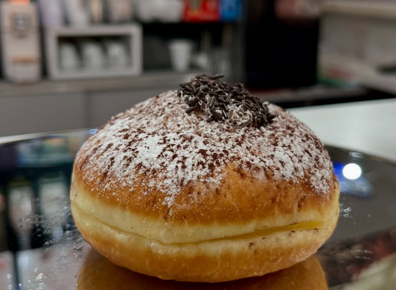
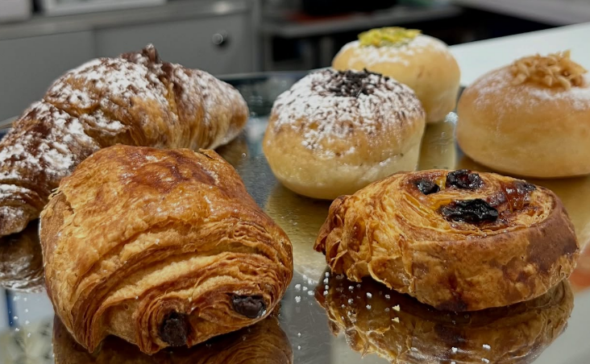
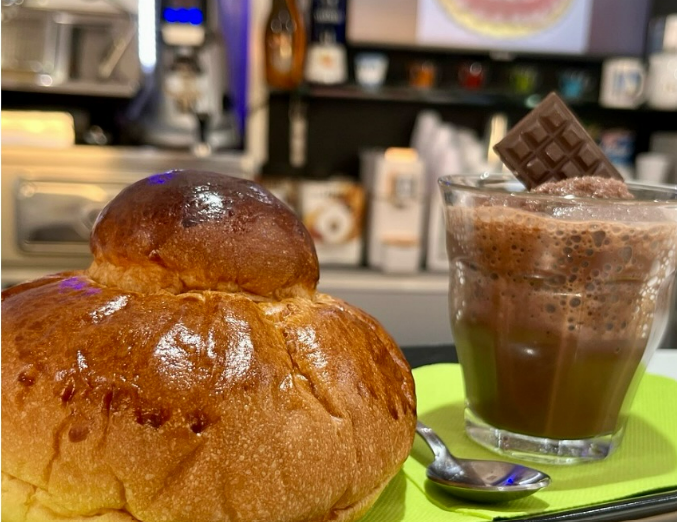
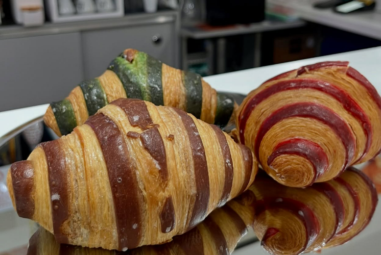

<section>
  <h2>La Colazione da Zanzibar</h2>
  

    La mattina da Zanzibar inizia con il profumo di brioche appena sfornate, farcite al momento con le nostre creme artigianali: pistacchio puro, cioccolato fondente, marmellate di stagione e crema pasticcera. 
    Accompagniamo ogni dolce con un cappuccino cremoso, caffè espresso 100% arabica, o con una delle nostre alternative come ginseng, orzo o latte vegetale.
  

  

    Per chi ama la colazione salata, prepariamo toast caldi con pane croccante, affettati selezionati e formaggi freschi, uova strapazzate su richiesta e tramezzini leggeri. 
    Ogni giorno puoi trovare anche una selezione di torte fatte in casa: crostate, plumcake, torta di mele e cheesecake.
  

  

    Disponibili anche opzioni per intolleranti al lattosio e al glutine, su richiesta.
  

  
<strong>Allergeni:</strong> Glutine, latte, uova, frutta a guscio, soia. (Contattaci per opzioni senza allergeni.)

</section>

