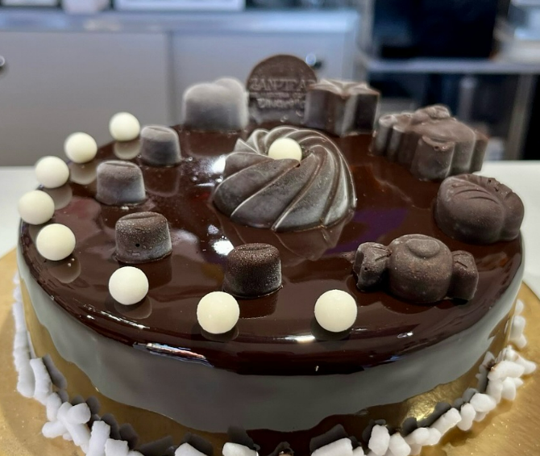
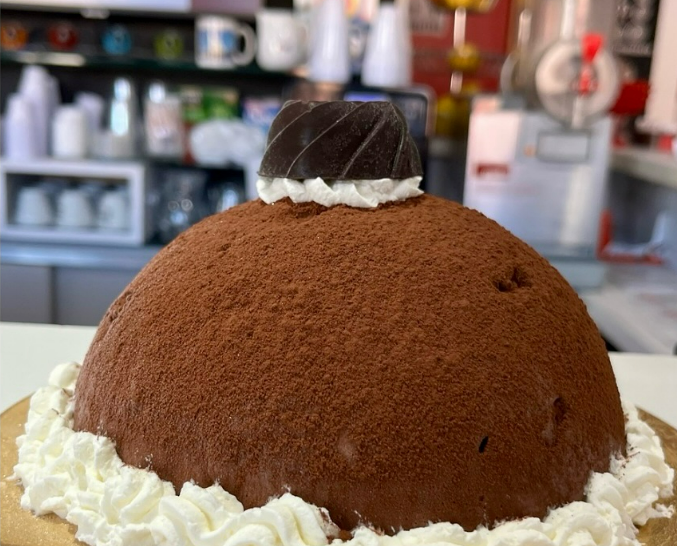
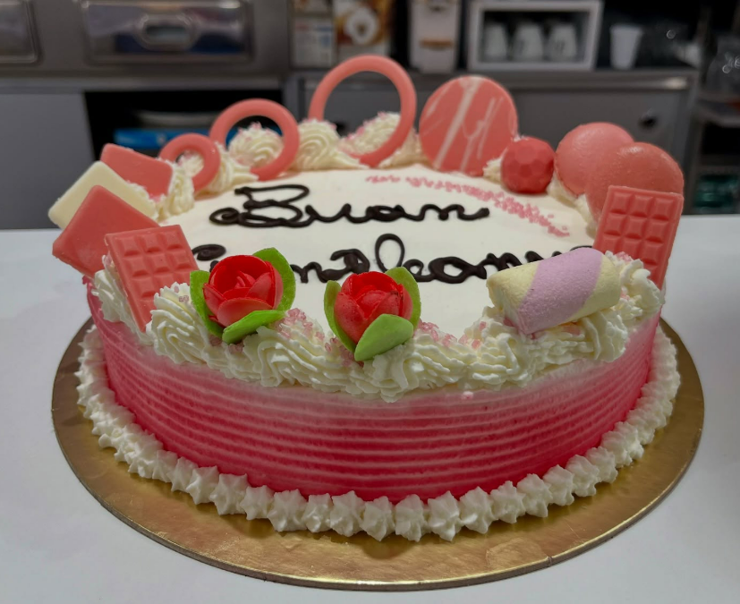
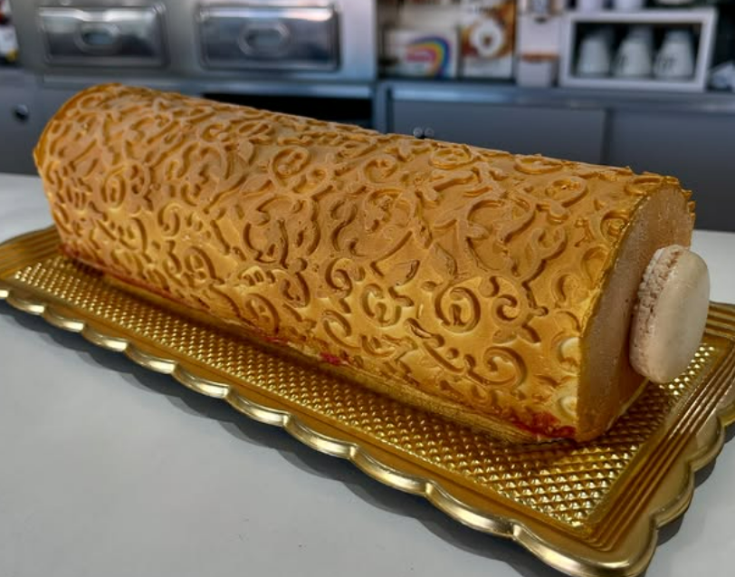
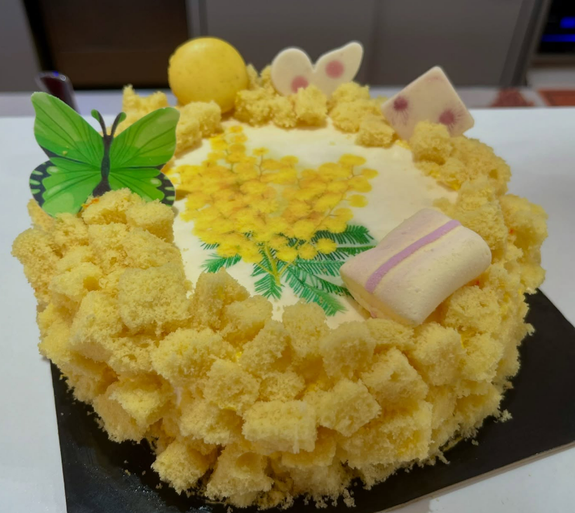
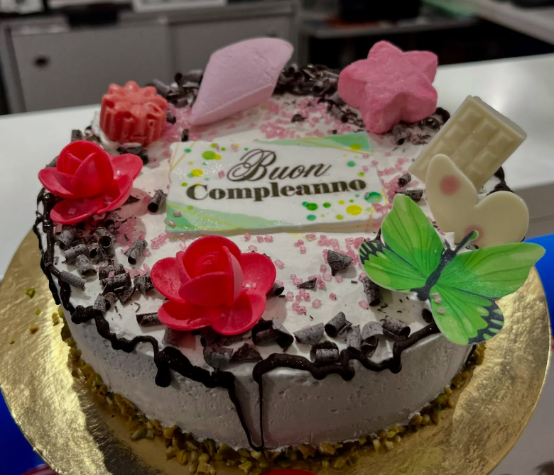
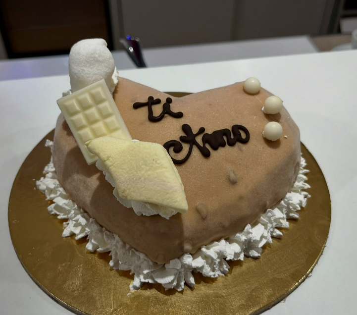

  

    
    
Cioccolato Compleanno

  

  

    
    
Tartufone

  

  

    
    
Compleanno

  

  

    
    
Tronchetto gelato

  

  

    
    
Torta Montagna

  

  

    
    
Torta Mimosa

  

  

    
    
Compleanno

  

  

    
    
San Valentino

  

  Hai in mente una torta speciale? La realizziamo su misura per te! Scrivici o chiamaci, trovi tutto nella sezione <strong>Contatti</strong>.

